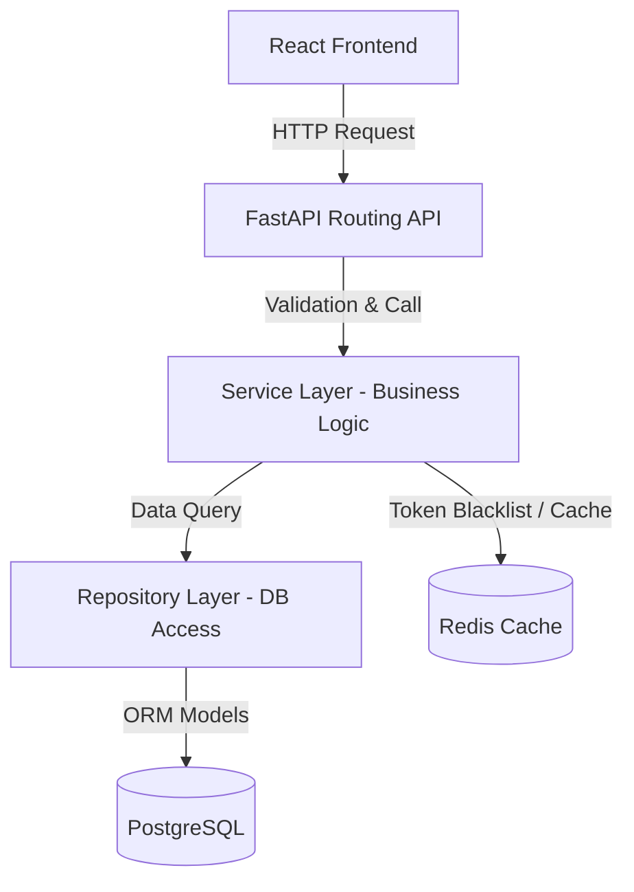

# System Architecture

The Bangladesh Tax Suite follows a **Clean Architecture + Modular Monolith** structure designed to scale while keeping components decoupled.

## Architecture Diagram



## Layers of the Monolith

1. **API Router Layer (`app/api/` or `app/modules/*/api.py`)**
   - Handles HTTP routing, input validation (using Pydantic), and HTTP exceptions.
   - Inject dependencies such as DB sessions and authenticated users.

2. **Service Layer (`app/modules/*/service.py`)**
   - Implements the core business logic.
   - Aggregates database actions and controls transaction lifecycles.
   - Throws semantic exceptions that the API layer translates to HTTP responses.

3. **Repository Layer (`app/modules/*/repository.py`)**
   - Manages raw database queries (via SQLModel).
   - Keeps DB operations testable and isolated from business rules.

4. **Model/Schema Layer (`app/modules/*/model.py`, `schema.py`)**
   - `model.py` maps database tables.
   - `schema.py` defines Pydantic validation structures for request and response formats.

## Folder Organization

```text
bangladesh-tax-suite/
├── backend/
│   ├── app/
│   │   ├── core/         # Settings, JWT, security configuration
│   │   ├── db/           # Session management, SQLModel engines
│   │   ├── modules/      # Domain modules (Auth, Users, Employee, etc.)
│   │   │   ├── auth/     # Login, refresh token, session routes
│   │   │   └── users/    # User profiles, CRUD operations
│   │   ├── utils/        # Generic tools (Redis client, logger)
│   │   └── main.py       # FastAPI application initialisation
│   └── tests/            # Test suite (conftest, integration cases)
├── frontend/
│   ├── src/
│   │   ├── components/   # Shared presentation elements (Loader, guards)
│   │   ├── pages/        # Router page components (Login, Dashboard)
│   │   ├── services/     # Axios client configuration and interceptors
│   │   └── App.tsx       # Routing logic
└── docker/               # Container configs (Nginx, postgres, etc.)
```
