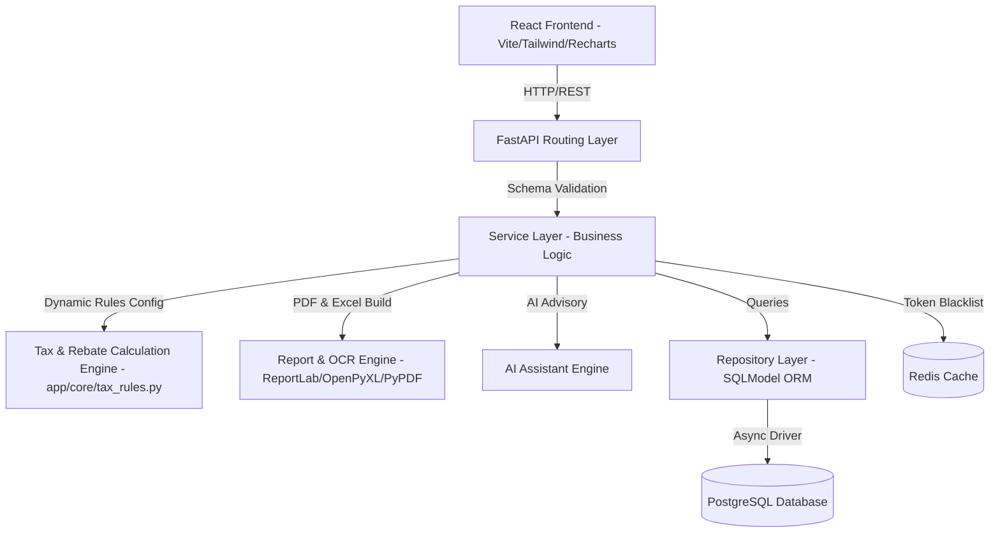

# System Architecture

The Bangladesh Tax Suite follows a **Clean Architecture + Modular Monolith** structure designed for scalable SaaS applications.

## Architecture Diagram



## Layers of the Monolith

1. **API Router Layer (`app/modules/*/api.py`)**
   - Handles REST HTTP routing, request validation via Pydantic v2, and access control dependencies (`get_current_user`).

2. **Service Layer (`app/modules/*/service.py`)**
   - Contains business logic (Tax slab calculations, 15% Section 78 rebate caps, OCR regex PDF text extraction, AI Tax advice, ReportLab PDF rendering).

3. **Repository Layer (`app/modules/*/repository.py`)**
   - Encapsulates database CRUD operations using SQLModel and SQLAlchemy AsyncSession.

4. **Model & Schema Layer (`model.py`, `schema.py`)**
   - `model.py` defines database table entities.
   - `schema.py` defines type-safe Pydantic request/response validation schemas.

---

## Domain Modules Structure

```text
backend/app/modules/
├── auth/          # JWT Login, Multi-Role Register, Refresh Token, Logout
├── users/         # Super Admin Oversight, User status approval/suspension
├── employers/     # Corporate employer registrations and company directories
├── employees/     # Employee job profiles, tax zone/circle, NID info
├── salaries/      # Monthly salary slips, PDF payslips, annual summary
├── investments/   # DPS, Sanchayapatra, Insurance, AIT Challan tracking
├── taxes/         # Income Tax Act 2023 engine, Form 108 / Return HTML viewer
├── reports/       # ReportLab PDF return exporter & OpenPyXL Excel exporter
├── ocr/           # PyPDF OCR text parser for uploaded salary PDFs
└── ai/            # AI Tax Advisory Assistant based on Act 2023 regulations
```
